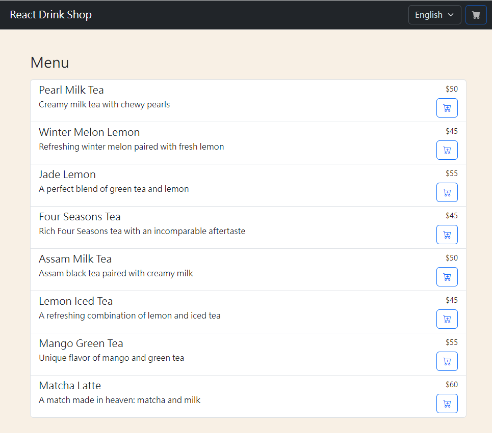
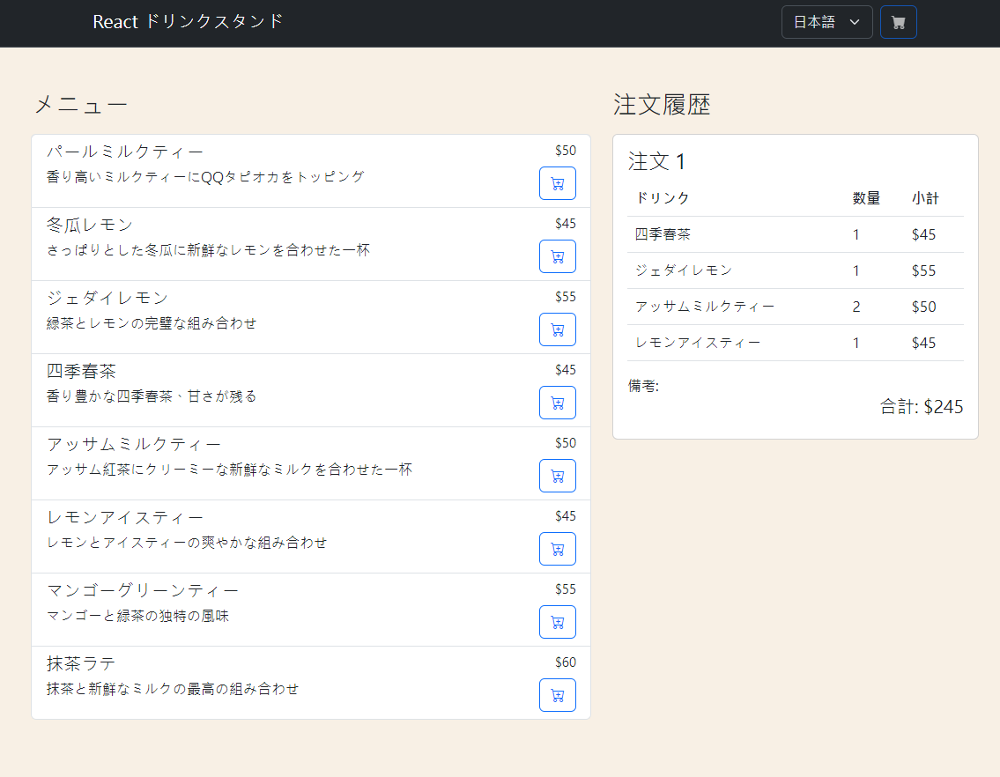

# React Drink Shop

A simple multi-language drink ordering web application built using React. Users can browse the menu, add drinks to their cart, view their cart, and proceed with the order. Additionally, users can view their order history.

## Screen Shot

Screen Shot 1


Screen Shot 2


## Features:

1. Multi-Language Support: The website supports English, Japanese, and Chinese (Traditional).
2. Interactive Cart: Add items to cart, modify quantities, view total amounts, and proceed to order.
3. Order History: View previous orders with details such as drink name, quantity, and total amount.

## Technologies Used:

- React.js
- Vite.js
- Bootstrap (for styling)

## Components:

App - The main component that integrates other components and handles state management.
DrinkItemRow - Displays individual drinks available for order.
CartModal - Modal pop-up displaying cart contents, with options to modify items or place an order.
OrderHistory - Component to display a history of user's orders.

## Installation & Setup:

1. Clone the repository:

```
git clone [repository-url]
```

2. Change into the directory:

```
cd [directory-name]
```

3. Install dependencies:

```
npm install
```

4. Run the application:

```
npm run dev
```

5. Open your browser and go to `http://localhost:5173` to view the application.

## Directory Structure:

- assets/ - Contains JSON data files for drinks and language translations.
- components/ - Contains React components (DrinkItemRow, CartModal, and OrderHistory).

## Future Improvements (Maybe):

- Implement user authentication to store and retrieve individual user orders.
- Add more comprehensive error handling and notifications.
- Integrate with a backend and database to store order details and manage inventory.

## Developer - 開發者

[Steven Chang](https://github.com/steven4program)
